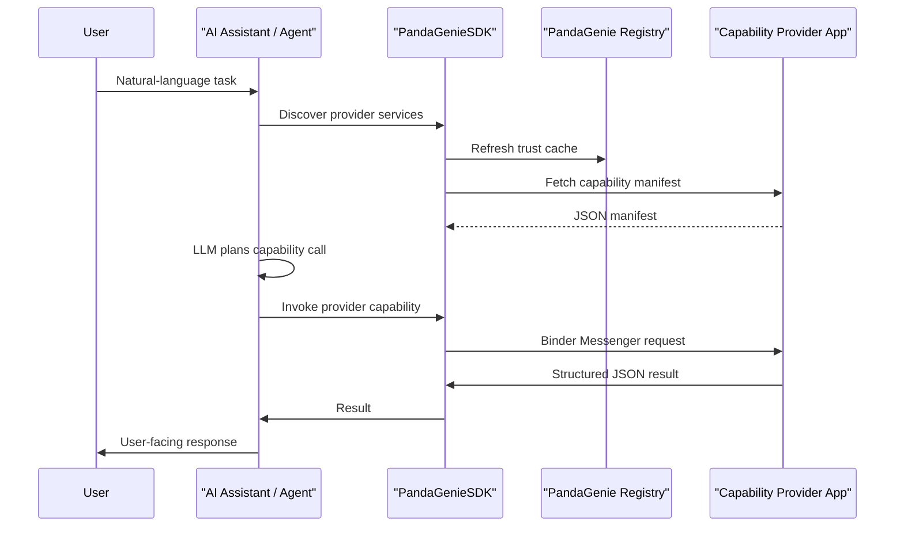

# PandaGenieSDK Architecture

PandaGenieSDK turns Android apps into explicit capability providers that can be called by an approved AI assistant. The design avoids scraping UI or guessing intents when an app can expose a typed capability instead.

## Roles

| Role | App type | Responsibility |
|---|---|---|
| Agent | AI assistant app | Discover providers, collect capability manifests, pass capability knowledge to the LLM, invoke selected capabilities, and render results. |
| Provider | Callable app | Declare exported capabilities, validate callers, execute app-owned logic, and return structured results. |

A single APK may register both roles, but review and trust decisions are role-specific.

## High-Level Flow



## Trust Model

The trust identity is:

```text
sha256(packageName|normalizedReleaseSignatureSha256|role)
```

The server publishes approved, non-blacklisted identities in `/sdk/trust-cache`. SDK clients cache the response locally to avoid a server call on every invocation.

Trust rules:

- Agent discovery hides providers that are not trusted for the `provider` role.
- Provider invocation rejects callers that are not trusted for the `agent` role.
- Blacklist applies to both roles and is keyed by package name plus release signature.
- Debug signing is not a production identity. Use release signatures for review.

## Capability Manifest

Every provider exposes a manifest describing what it can do. The manifest is designed to be readable by both humans and LLM planners.

Recommended capability fields:

| Field | Meaning |
|---|---|
| `id` | Stable capability id, such as `notes.create` or `account.open_profile`. |
| `title` | Short user-facing name. |
| `description` | What the capability does and when to use it. |
| `kind` | Implementation surface: `service`, `activity`, `provider`, `broadcast`, or a custom value. |
| `riskLevel` | `low`, `normal`, `sensitive`, or `destructive`. |
| `permissions` | App-level or data-level permissions needed by the provider. |
| `inputSchema` | JSON description of expected parameters. |

## Invocation Surface

The first SDK version standardizes a service-based entry point because it gives the SDK one reliable IPC path:

```text
ai.rorsch.pandagenie.sdk.action.CAPABILITY_SERVICE
```

Provider capabilities can internally perform different Android actions:

- Start an Activity and pass display parameters.
- Query a ContentProvider owned by the app.
- Send a Broadcast to app components.
- Run a Service task and return a result.
- Open a system or app-specific page.

The capability manifest should describe the high-level capability, not leak implementation details unless the assistant needs them.

## Server Responsibilities

The PandaGenie server owns:

- App registration application.
- Admin review workflow.
- Approved identity publishing.
- Blacklist checks.
- Invocation and usage audit logs.
- Developer-facing SDK pages and docs.

The SDK should remain small and stable. Any policy that may change quickly should be server-driven through the trust cache.

